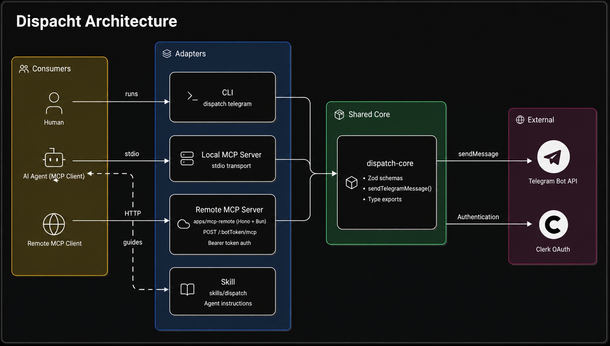

<h1 align="center">Dispatch</h1>

> Build agent-ready tools from a single shared TypeScript core.

Dispatch is an open-source toolkit that exposes the same business logic through a CLI, a local MCP server, a remote MCP server, and AI Skills. It demonstrates how to build reusable agent tooling without duplicating business logic.


## Quick Start

```bash
npm install -g @amarnath00/dispatch
dispatch init --telegram-bot-token "<bot-token>"
dispatch telegram "<chat-id>" "Hello from Dispatch"
```

<details>
<summary><strong>Table of contents</strong></summary>

- [What Is Dispatch?](#what-is-dispatch)
- [Architecture](#architecture)
- [Prerequisites](#prerequisites)
- [Use Dispatch](#use-dispatch)
- [Run Locally](#run-locally)
- [Publishing](#publishing)
- [Troubleshooting](#troubleshooting)

</details>

## What Is Dispatch?

Dispatch is a reference implementation for turning one capability into agent-ready tooling: a CLI command, a local MCP tool, and a remote MCP server, all backed by the same core operation.

The example operation sends Telegram messages, but the pattern generalizes to any action: swap the operation in `packages/core`, update the three adapters, and you have a starting point for a different integration.

Business logic lives in `packages/core`. The CLI, local MCP server, and remote MCP server are all thin adapters around it, so agents, scripts, and humans use the same implementation.

## Architecture

<p align="center">
  
</p>


packages/core:

 - Zod schemas for shared inputs and outputs.
 - Operation functions such as sendTelegramMessage.
 - Type exports derived from schemas.
 - No CLI imports, MCP SDK imports, terminal output or prompts.

packages/cli:

 - Defines dispatch telegram <chatId> <message>.
 - Parses command arguments with Commander.
 - Calls @amarnath00/dispatch-core functions.
 - Prints readable output by default.
 - Supports --json for scriptable and agent-readable output.

packages/mcp-local:

 - Creates an MCP stdio server.
 - Registers a telegram tool backed by @amarnath00/dispatch-core.
 - Uses the shared Telegram message input schema.
 - Returns both content and structuredContent.

apps/mcp-remote:

 - Creates a Hono HTTP app exposing /:botToken/mcp, run by Bun in development.
 - Registers a telegram tool backed by @amarnath00/dispatch-core.
 - Reads the Telegram bot token from the URL path per request.
 - Keeps the token out of the MCP tool input schema.
 - Closes the per-request MCP server after handling the request.

skills/dispatch:

 - Prefers the MCP telegram tool when available.
 - Documents CLI fallback usage.
 - Explains that @amarnath00/dispatch-core is an implementation detail.
 - Avoids duplicating business logic.

## Prerequisites

- A Telegram bot token, from [@BotFather](https://t.me/BotFather).
- Node.js for using the published CLI/MCP packages.
- Bun for running or modifying the repository from source.
- A Node-compatible MCP client if you want to connect the local MCP server.

## Use Dispatch

### CLI

```bash
npm install -g @amarnath00/dispatch
dispatch init --telegram-bot-token "<bot-token>"
dispatch telegram "<chat-id>" "Hello from Dispatch"
```
Get your `chatId` by opening the following URL in your browser:

`https://api.telegram.org/bot<YOUR_BOT_TOKEN>/getUpdates`

Replace `<YOUR_BOT_TOKEN>` with the token provided by BotFather.

Note: The CLI always prints JSON, since it's meant to be readable by both humans and scripts/agents.

Expected Output:

```json
{
  "ok": true,
  "chatId": "<chat-id>",
  "messageId": 123
}
```

Config is stored at `~/.config/dispatch/config.json`.

### Local MCP

Install the local MCP stdio server globally:

```bash
npm install -g @amarnath00/dispatch-mcp
```

Configure your MCP client to run dispatch-mcp and pass `TELEGRAM_BOT_TOKEN` through the environment:

```json
{
  "mcpServers": {
    "dispatch": {
      "command": "dispatch-mcp",
      "args": [],
      "environment": {
        "TELEGRAM_BOT_TOKEN": "<bot-token>"
      }
    }
  }
}
```

Or, without a global install:

```json
{
  "mcpServers": {
    "dispatch": {
      "command": "npx",
      "args": ["-y", "@amarnath00/dispatch-mcp"],
      "environment": {
        "TELEGRAM_BOT_TOKEN": "<bot-token>"
      }
    }
  }
}
```

The server exposes a single tool, `telegram`, which accepts `{ chatId, message }` and returns `{ ok, chatId, messageId }`.

### Remote MCP

This repository includes a remote MCP HTTP adapter (`apps/mcp-remote`), but Dispatch does not host a public endpoint — deploy your own copy.

The server exposes `POST /:botToken/mcp`, where `botToken` is the URL-encoded Telegram bot token for that request.

Treat that URL as a secret: anyone with it can send messages through the bot. If it leaks, revoke and rotate the token with BotFather immediately.

The remote server is protected with Clerk OAuth. Set these before starting it:

```bash
CLERK_PUBLISHABLE_KEY="<publishable-key>" \
CLERK_SECRET_KEY="<secret-key>" \
bun run dev:mcp-remote
```

Unauthenticated requests get `401 Unauthorized` with a `WWW-Authenticate` header pointing at `/.well-known/oauth-protected-resource/:botToken/mcp`; MCP OAuth clients use that to drive the login flow. 

In the Clerk Dashboard, enable Dynamic client registration for OAuth applications before testing with MCP clients that require automatic OAuth client registration.

ChatGPT web and Claude web support can vary by current MCP OAuth client behavior.

Claude web connects out of the box: it performs OAuth Dynamic Client Registration automatically, so no manual OAuth client setup is needed.

ChatGPT connectors and custom apps do not support Dynamic Client Registration. You must create your own OAuth client in the Clerk Dashboard, then:

 - Copy ChatGPT's redirect/callback URI and add it to the allowed redirect URIs on your Clerk OAuth client.
 - Provide the resulting client ID and client secret to ChatGPT when configuring the connector.

ChatGPT connector configuration:

```bash
Name: Dispatch
Description: Send Telegram messages through Dispatch MCP.
MCP Server URL: https://your-dispatch-host.example.com/<telegram-bot-token>/mcp
Authentication: OAuth
```

### Skill

Install the Dispatch Skill with your skill manager:

```bash
npx skills add https://github.com/amarnath0038/dispatch/tree/main/skills/dispatch
```

The Skill tells agents when to use the MCP telegram tool, when to fall back to the CLI, why --json matters for parsing, and why @amarnath00/dispatch-core is only an implementation detail.

CLI fallback example from the Skill:

```bash
dispatch init --telegram-bot-token "<bot-token>"
dispatch telegram "<chat-id>" "Dispatch test message"
```

## Run Locally

Install workspace dependencies:

```bash
bun install
```

Run CLI from source:

```bash
bun run dev:cli init --telegram-bot-token "<bot-token>"
bun run dev:cli telegram "<chat-id>" "Hello from Dispatch"
```

Start the local MCP stdio server from source:

```bash
TELEGRAM_BOT_TOKEN="<bot-token>" bun run dev:mcp-local
```

**Expected behavior:** The process stays open and waits for MCP messages over stdio. 

Example MCP client config from the repository root:

```json
{
  "mcpServers": {
    "dispatch": {
      "command": "bun",
      "args": ["run", "packages/mcp-local/src/index.ts"],
      "environment": {
        "TELEGRAM_BOT_TOKEN": "<bot-token>"
      }
    }
  }
}
```

Start the remote MCP HTTP server from source:

```bash
CLERK_PUBLISHABLE_KEY="<publishable-key>" \
CLERK_SECRET_KEY="<secret-key>" \
bun run dev:remote-mcp
```

**Expected behavior:** the server listens on PORT or 3000 by default, exposes public protected resource metadata at GET /.well-known/oauth-protected-resource/:botToken/mcp, and protects POST /:botToken/mcp with Clerk OAuth.

### Local Linked Binary

Use `bun link` to test the CLI as a real `dispatch` command before publishing:

```bash
cd packages/cli
bun link
dispatch --help
```
After linking the binary, these can be run from anywhere on the machine:

```bash
dispatch init --telegram-bot-token "<bot-token>"
dispatch telegram "<chat-id>" "Hello from Dispatch"
```
To remove the local linked binary, run this from packages/cli:

```bash
bun unlink
```


### Verification commands

```bash
bun install
bun run format:check
bun run lint
bun run typecheck
bun run dev:cli init --telegram-bot-token "<bot-token>"
bun run dev:cli telegram "<chat-id>" "Hello from Dispatch"
```

## Telegram Operation

Public interface names:

```bash
core function: sendTelegramMessage
CLI command:   dispatch telegram <chatId> <message>
MCP tool:      telegram
Skill usage:   telegram
```

Telegram messages are sent through the Telegram Bot API. The CLI reads the bot token from local user config created by `dispatch init`. The local MCP server reads TELEGRAM_BOT_TOKEN from the MCP client-provided server environment. The remote MCP server reads the token from the per-request MCP URL path. All adapters pass the token into @amarnath00/dispatch-core; it is not exposed as an MCP tool argument.

## Publishing

@amarnath00/dispatch-core is the shared implementation package used by the CLI, MCP servers, and downstream programmatic consumers. Publish it from packages/core, not from the repository root.

@amarnath00/dispatch is the published CLI package. It depends on the published core package, so publish core first whenever a release includes core changes.

@amarnath00/dispatch-mcp is the published local MCP stdio server package. It also depends on the published core package, so publish core first whenever a release includes core changes.

Dispatch uses Bun workspaces with `oxlint`/`oxfmt` for linting and formatting. `bun publish` resolves `workspace:*` core dependencies to the currently published core version, so publish order matters:

1. Bump and publish `packages/core` first if core changed.
2. Publish `packages/cli` and `packages/mcp-local` after, since both depend on the published core version.

```bash
cd packages/core && bun publish --dry-run && bun publish
cd packages/cli && bun publish --dry-run && bun publish
cd packages/mcp-local && bun publish --dry-run && bun publish
```

npm versions are immutable — if a publish is accepted but later verification fails, bump to a new version rather than reusing one. Commit version bumps and lockfile changes before publishing, so the published package is traceable to a specific commit.

## Troubleshooting

- **MCP client can't start the server** — confirm the command is on `PATH`, or use `npx -y @amarnath00/dispatch-mcp` / an absolute path.
- **Local MCP server looks hung** — expected for stdio mode; it's waiting for client messages until stopped.
- **CLI says a bot token is required** — run `dispatch init --telegram-bot-token <token>` first.
- **Telegram requests fail** — confirm the bot can message the target chat, and that the chat ID is correct (`https://api.telegram.org/bot<token>/getUpdates` lists recent chats).
- **Remote MCP returns 401** — confirm `CLERK_PUBLISHABLE_KEY`/`CLERK_SECRET_KEY` are set and the request includes a valid `Authorization: Bearer` header.